
<h1 align="center">火锅店管理系统</h1>

## 简介
火锅店管理系统：角色分为管理员、会员；功能包括首页、菜品管理、订单管理、论坛互动、公告信息、个人中心、后台管理及购物车功能，以提升用户体验和店铺运营效率。    --计算机毕业设计源码；毕设源码；java毕业设计源码

## 联系方式

<h3 align="center">获取完整代码与数据库文件 + 微信：deepguan QQ: 86050149 QQ群: 783742310</h3>

<h3 align="center">可帮忙远程部署 包运行成功！提供远程部署、修改代码、设计文档指导、代码讲解等服务！</h3>

## 功能介绍（完整见运行截图）
管理员：管理员可以通过管理界面对火锅店的各项功能进行管理，包括管理员工、菜品管理、订单管理、数据库管理、论坛管理、公告信息、会员管理和轮播图信息等模块。论坛管理界面允许管理员查看和管理帖子，提供回复和删除操作。订单管理页面提供订单信息查看、订单确认功能。登录界面上，管理员可以选择角色进行身份验证。

会员：会员可以通过网站首页浏览菜品列表，访问论坛和公告信息，使用购物车进行菜品购买并管理个人中心信息。在评论功能区，会员可以填写和提交菜品评价。个人中心支持评价管理、查看个人收藏和订单历史记录。会员在登录界面选择会员角色登录，并可通过注册功能成为网站活跃用户。

游客：游客可以访问系统的主页查看基本的首页导航栏功能，如菜品展示、购物车等模块。虽然游客在未登录的状态下只能查看页面信息但无法对论坛帖子进行回复或发表评论，若试图访问需登录的功能，将收到未被授权的提示信息。游客可以通过注册成为会员以解锁更多功能。

通用功能：系统中提供了灵活的导航栏设计，方便不同用户角色访问火锅店相关功能模块，包括首页、菜品、论坛、公告信息、后台管理及个人中心等。无论是管理员还是会员，都可以通过搜索框查找特定菜品或帖子，并利用轮播图功能查看更多内容。购物车和订单结算功能帮助用户高效管理自己的消费记录。

## 运行截图
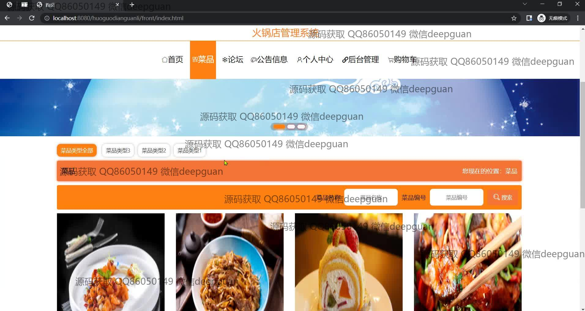
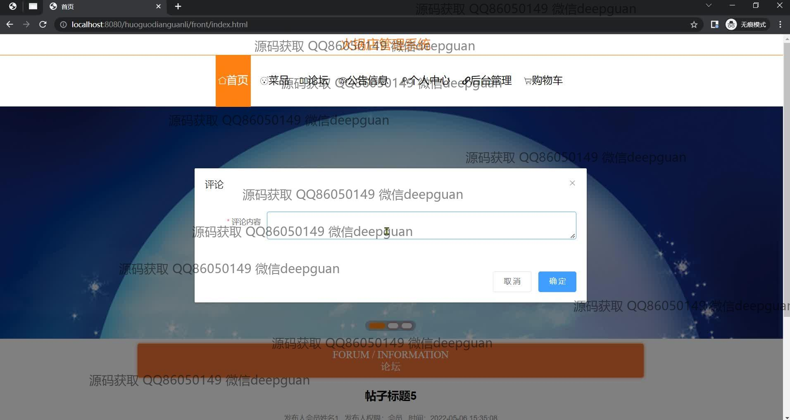
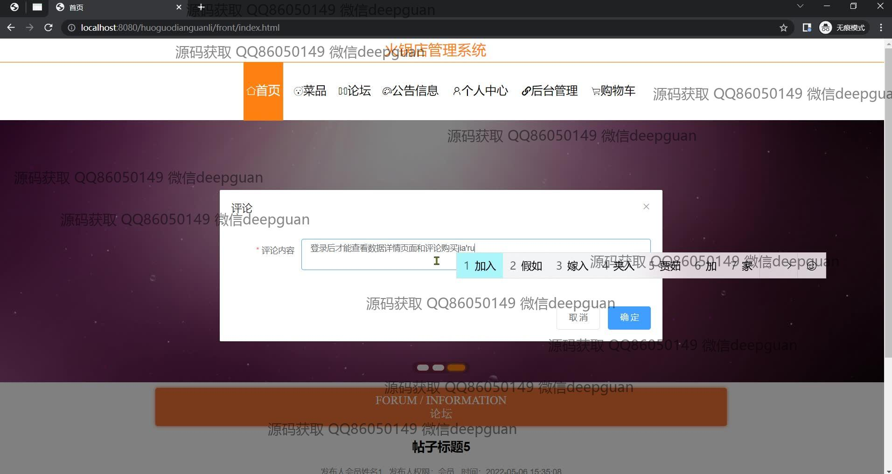
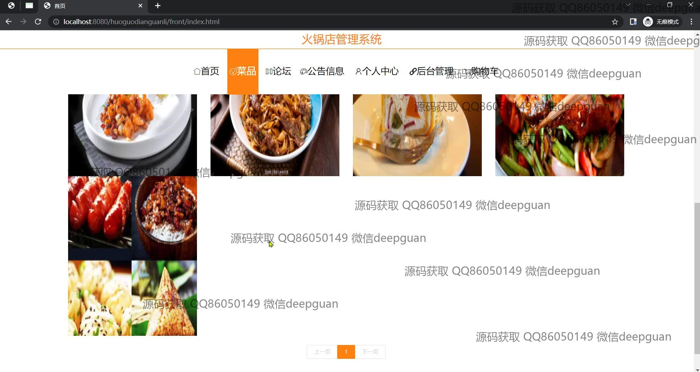
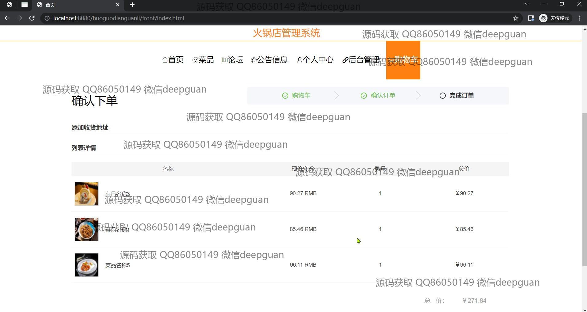
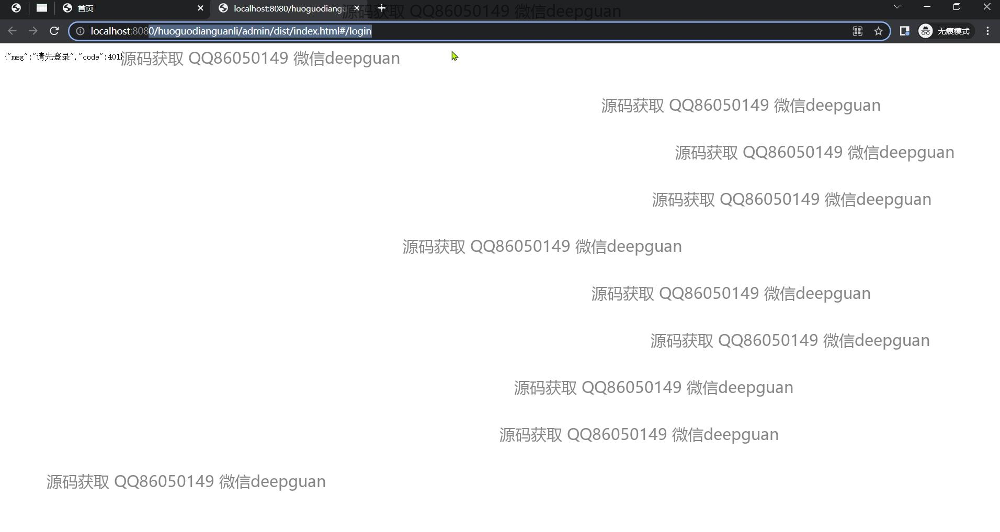
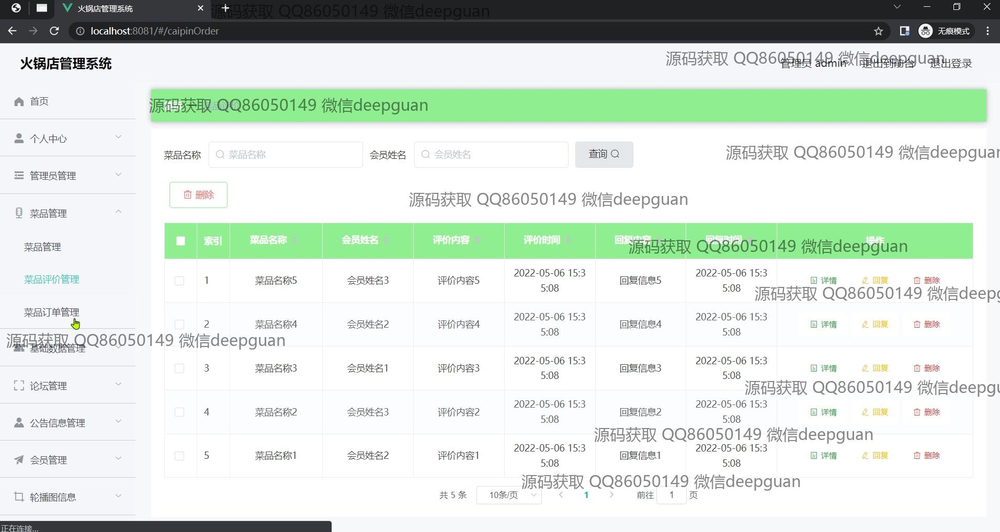
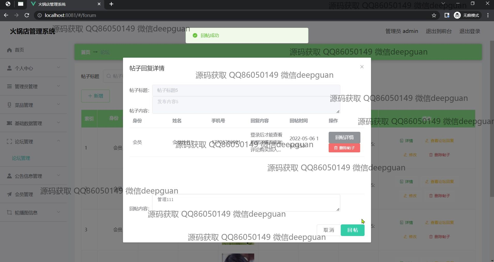
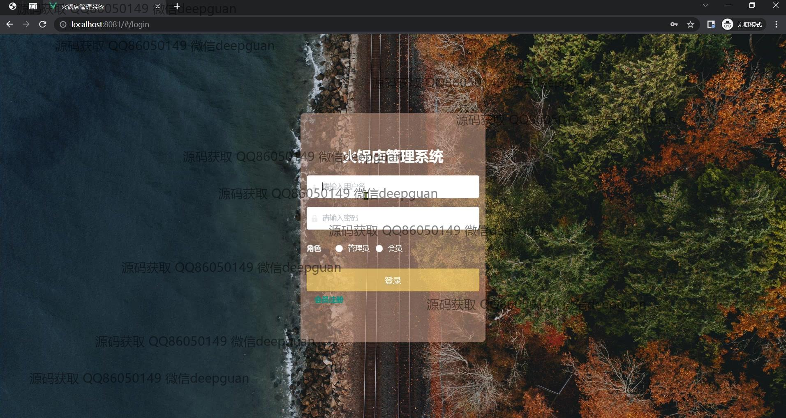
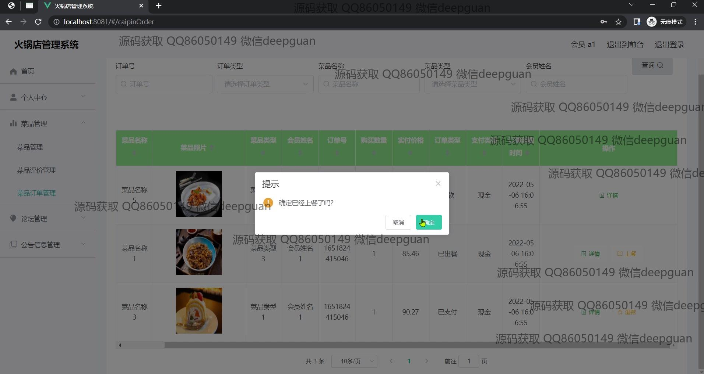
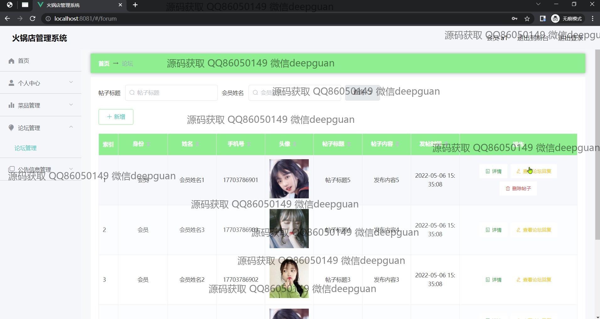
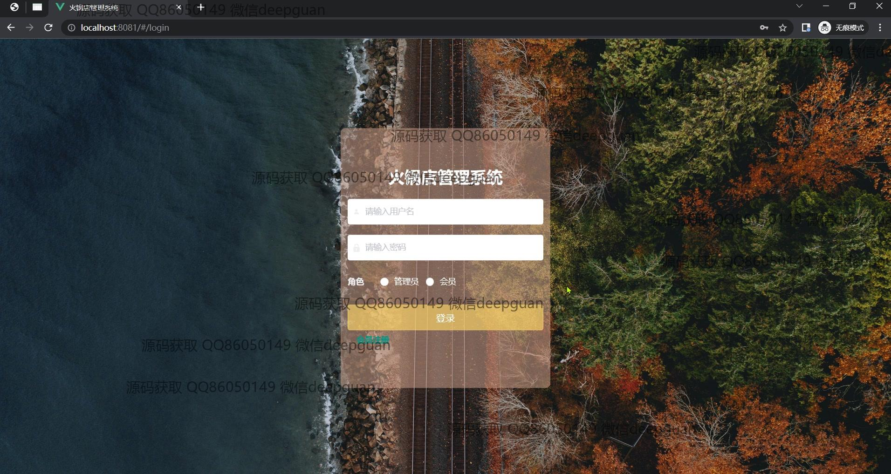

本代码来源于网络,仅供学习参考使用!

